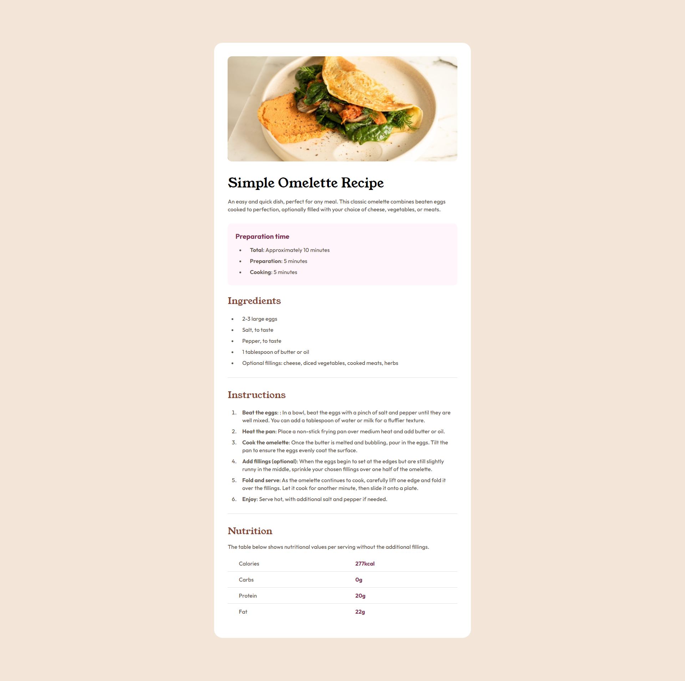

# Frontend Mentor - Recipe page solution

This is a solution to the [Recipe page challenge on Frontend Mentor](https://www.frontendmentor.io/challenges/recipe-page-KiTsR8QQKm). Frontend Mentor challenges help you improve your coding skills by building realistic projects.

## Table of contents

- [Overview](#overview)
  - [Screenshot](#screenshot)
  - [Links](#links)
- [My process](#my-process)
  - [Built with](#built-with)
  - [What I learned](#what-i-learned)
  - [Continued development](#continued-development)
  - [Useful resources](#useful-resources)
- [Author](#author)
- [Acknowledgments](#acknowledgments)

## Overview

### Screenshot



### Links

- Live Site URL: (https://recipie-page-fm.vercel.app/)

## My process

### Built with

- Semantic HTML5 markup
- CSS custom properties
- Flexbox
- Mobile-first workflow

### What I learned

Working on this project, I learned how to effectively use CSS custom properties and Flexbox for creating responsive and maintainable layouts. Here are some code snippets that I'm particularly proud of:

```html
<section>
  <h2>Simple Omelette Recipe</h2>
  <p class="description">
    An easy and quick dish, perfect for any meal. This classic omelette combines
    beaten eggs cooked to perfection, optionally filled with your choice of
    cheese, vegetables, or meats.
  </p>
</section>
```

```css
:root {
  --nutmeg: hsl(14, 45%, 36%);
  --dark-raspberry: hsl(332, 51%, 32%);
  --white: hsl(0, 0%, 100%);
  --rose-white: hsl(330, 100%, 98%);
  --eggshell: hsl(30, 54%, 90%);
  --light-grey: hsl(30, 18%, 87%);
  --wenge-brown: hsl(30, 10%, 34%);
  --dark-charcoal: hsl(24, 5%, 18%);
}

body {
  background-color: var(--eggshell);
  display: flex;
  justify-content: center;
  align-items: center;
  height: 100vh;
}
```

### Continued development

In future projects, I want to continue focusing on improving my understanding and use of CSS Grid and advanced CSS techniques. Additionally, I plan to delve deeper into accessibility features to ensure all my web projects are usable by everyone.

### Useful resources

- [MDN Web Docs](https://developer.mozilla.org/) - This is an excellent resource for learning more about HTML and CSS properties. It helped me understand the use of CSS custom properties and Flexbox.
- [CSS-Tricks](https://css-tricks.com/) - This site provided clear and useful articles on CSS techniques which were invaluable during this project.

## Author

- Website - [Omkar Jadhav](https://github.com/omk1r))
- Frontend Mentor - [@omk1r](https://www.frontendmentor.io/profile/omk1r)
- Twitter - [@omk1rJ](https://www.twitter.com/omk1rJ)

## Acknowledgments

I'd like to thank the Frontend Mentor community for their feedback and support. The challenge was well-structured and provided a great opportunity to practice my skills. Special thanks to [Insert Name] for their insightful code reviews and suggestions.
